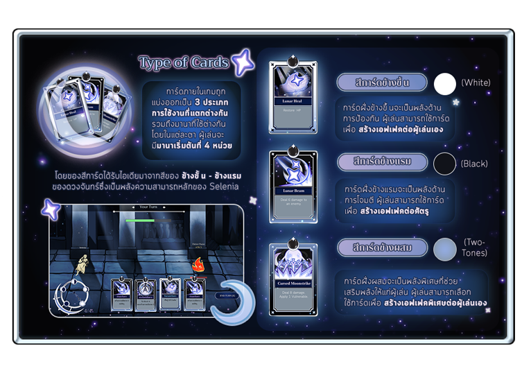

<p align="center">
  
</p>

# Heliora — Thailand Summer Jam 2026

A custom-built 2D game developed from scratch for **Thailand Summer Jam 2026**, powered entirely by a custom game engine built for this jam.

🎮 **Play it now:** [Heliora on itch.io](https://thepillowy.itch.io/heliora)

▶️ **Gameplay trailer:** [Watch on YouTube](https://youtu.be/WoQvntFnWaE?si=6u2wmpXezvTS0qrv)

## 🎮 How to Play

<p align="center">
  
</p>

## 🛠️ Tech Stack

- Language: **C++**
- Build System: **CMake**
- Version Control: **Git (with submodules)**

## 📦 Getting Started

### 1. Clone the Repository (with submodules)

This project uses **git submodules**, so make sure to clone it properly:

```bash
git clone --recurse-submodules https://github.com/ophoomo/thailand-summer-jam-2026.git
```
```bash
cd thailand-summer-jam-2026
```

### 2. Build the Project

Make sure you have:
- CMake (>= 4.3.1)
- C++ compiler (GCC / Clang / MSVC)

Build steps
```bash
cmake -S . -B build
cmake --build build
```

### 3. RUN
After building, you can run the executable:

GCC / Clang (Linux / macOS)
```bash
./build/src/game/tsj2026
```

MSVC (Window)
```bash
.\build\src\game\Debug\tsj2026.exe
```

## 🎯 Goals of the Project
- Understand low-level game engine architecture
- Practice designing reusable systems
- Learn how rendering and input systems work internally
- Build everything from scratch (no game engine frameworks)

## 🙌 Acknowledgements
- [Thailand Summer Jam 2026](https://itch.io/jam/thailand-summer-jam-2026)
- [ThePillowy](https://thepillowy.itch.io/)
- [@xthebasicx](https://github.com/xthebasicx)
- [Speto](https://speto-sandbox.itch.io/)
- Open-source libraries used via submodules